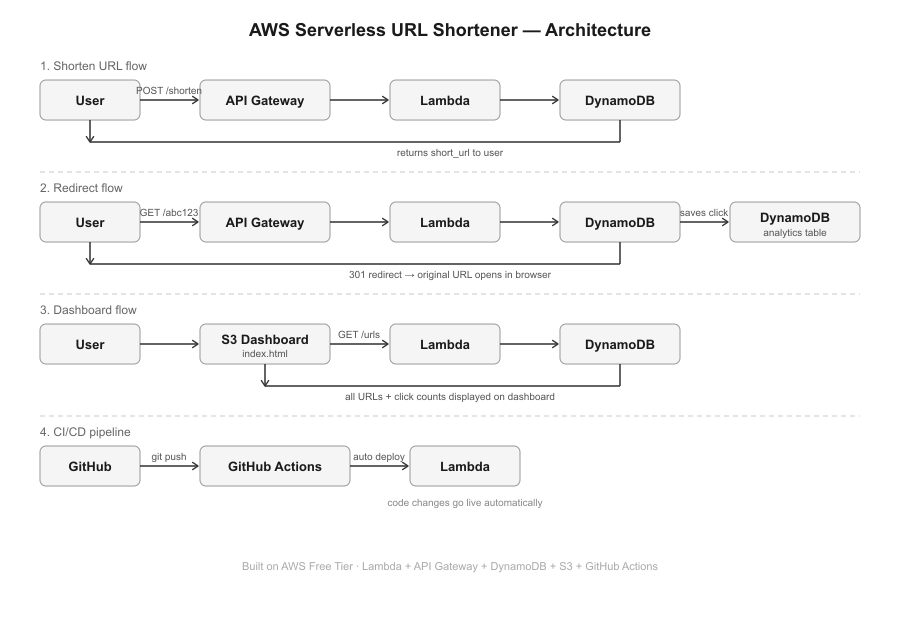
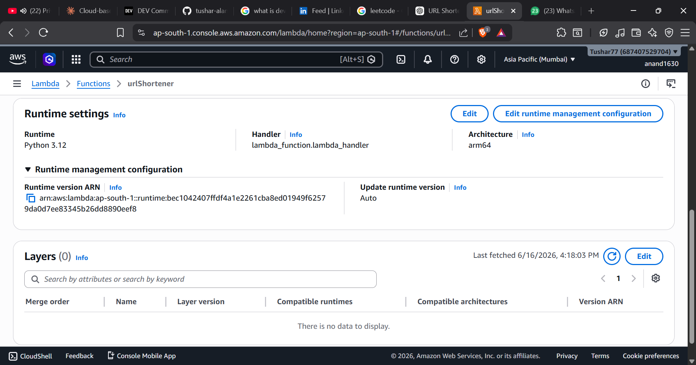
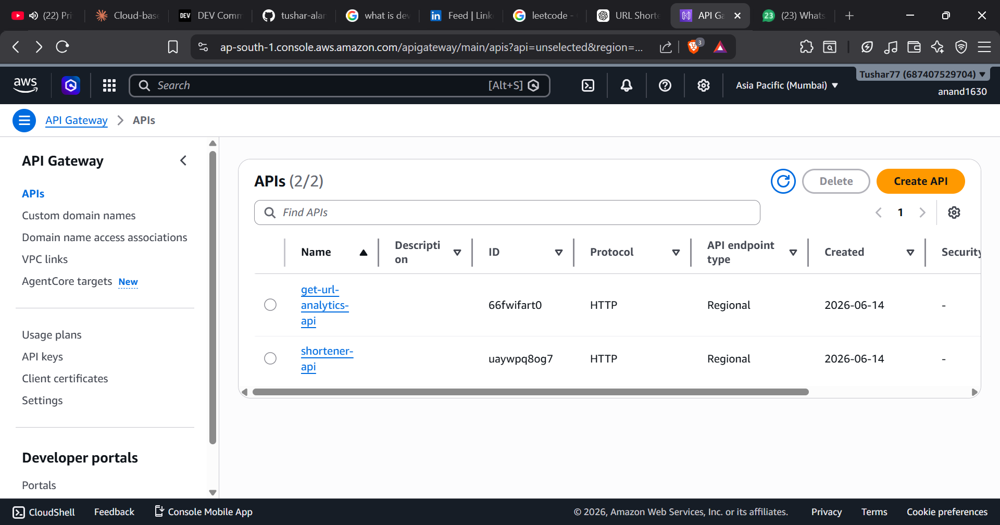
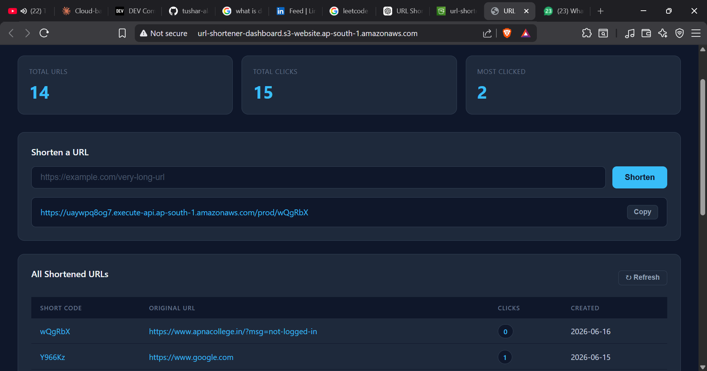
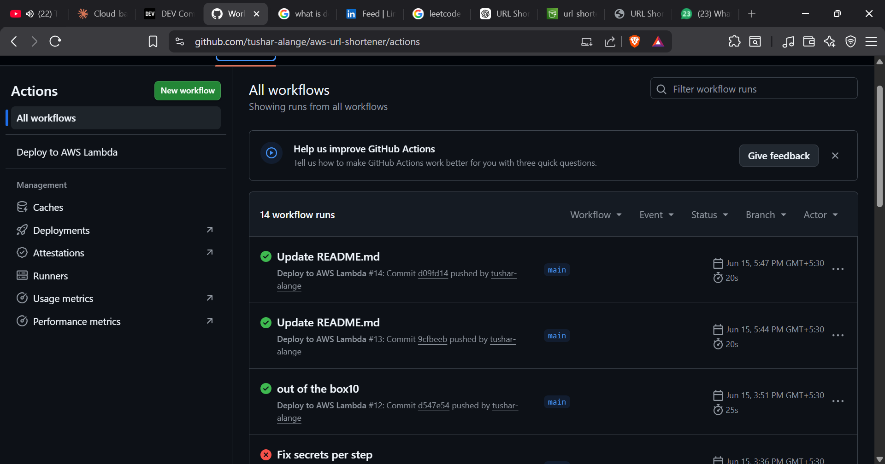

# 🔗 AWS Serverless URL Shortener

A fully serverless URL shortener with real-time analytics dashboard, built on AWS.

🌐 **Live Demo:** [Open Dashboard](https://dzrtckn81qqqh.cloudfront.net/)

---
## Blog Post

Read the full development journey here:

[Building a Serverless URL Shortener on AWS](https://dev.to/tusharalange/i-built-a-serverless-url-shortener-on-aws-4mp6)

---
## ⚙️ Architecture

```
User → API Gateway → Lambda (Python) → DynamoDB
                                   ↓
                           Analytics Table
                                   ↓
                         S3 Static Dashboard
```

## Architecture



## AWS Lambda



## API Gateway



## Dashboard



## CI/CD Pipeline




## 🛠️ AWS Services Used

| Service | Purpose |
|---|---|
| AWS Lambda | Serverless backend logic (Python) |
| API Gateway | HTTP API routing |
| DynamoDB | URL storage + click analytics |
| S3 | Static dashboard hosting |
| IAM | Secure role-based access |
| CloudWatch | Logging and monitoring |

## ✨ Features

- 🔗 Shorten any URL instantly
- 📊 Real-time analytics dashboard
- 👆 Click tracking per short URL
- 🌍 User agent and referrer logging
- ⚡ Serverless — scales automatically
- 💰 Runs on AWS Free Tier (₹0 cost)

## 🚀 API Endpoints

| Method | Endpoint | Description |
|---|---|---|
| POST | `/shorten` | Create a short URL |
| GET | `/{shortCode}` | Redirect to original URL |
| GET | `/urls` | Fetch all URLs for dashboard |

## 📦 Project Structure

```
aws-url-shortener/
├── lambda_function.py   # Backend logic (Lambda)
└── index.html           # Analytics dashboard (hosted on S3)
```

## 🧪 Test the API

```bash
curl -X POST https://uaywpq8og7.execute-api.ap-south-1.amazonaws.com/prod/shorten \
  -H "Content-Type: application/json" \
  -d '{"url": "https://www.google.com"}'
```

Response:
```json
{
  "short_code": "PLDpZK",
  "short_url": "https://uaywpq8og7.execute-api.ap-south-1.amazonaws.com/prod/PLDpZK",
  "long_url": "https://www.google.com",
  "message": "URL shortened successfully!"
}
```

## 🏗️ How to Deploy

1. Create AWS Lambda function (Python 3.12, ARM64)
2. Attach `AmazonDynamoDBFullAccess` IAM policy
3. Create DynamoDB tables: `url-shortener` and `url-analytics`
4. Create HTTP API in API Gateway with routes:
   - `POST /shorten`
   - `GET /{shortCode}`
   - `GET /urls`
   - `OPTIONS /{proxy+}`
5. Upload `index.html` to S3 with static website hosting enabled

## 👨‍💻 Author

Built by Anand — 4th year Computer Science student  
Part of cloud computing portfolio project.
